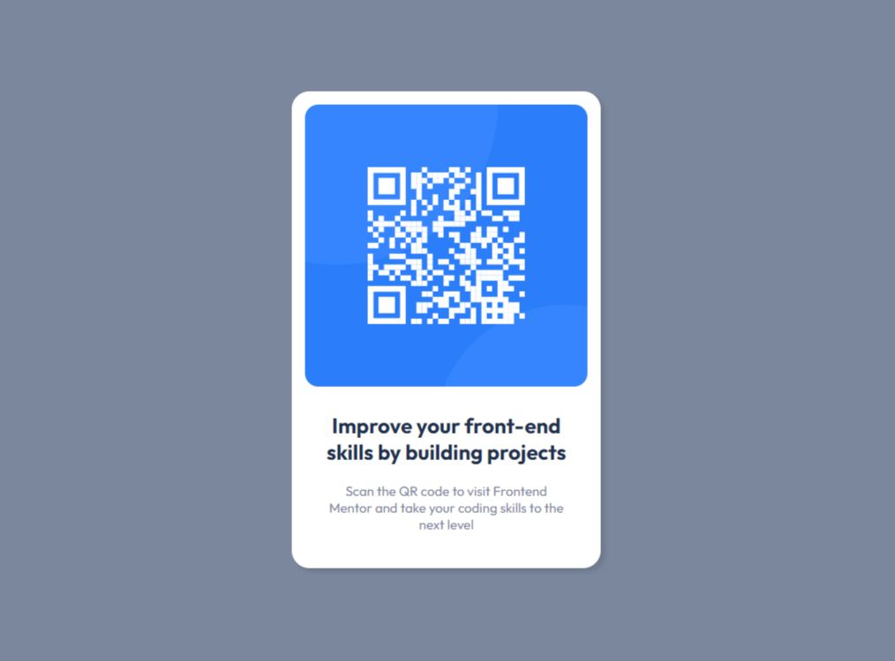

# Frontend Mentor - QR code component solution

This is a solution to the [QR code component challenge on Frontend Mentor](https://www.frontendmentor.io/challenges/qr-code-component-iux_sIO_H). Frontend Mentor challenges help you improve your coding skills by building realistic projects. 

## Table of contents

- [Overview](#overview)
  - [Screenshot](#screenshot)
  - [Links](#links)
- [My process](#my-process)
  - [Built with](#built-with)
  - [What I learned](#what-i-learned)
  - [Continued development](#continued-development)
  - [Useful resources](#useful-resources)
- [Author](#author)

## Overview

### Screenshot

### Links

- Solution URL: [https://github.com/karan819381/QR-code-component]
- Live Site URL: [https://karan819381.github.io/QR-code-component/]

## My process

### Built with

- Semantic HTML5 markup
- CSS custom properties
- Flexbox

### What I learned

- For me it was very dificult to choose the right properties in css to get the body and the .container to work and be seen as the style guide declared.

- At the end, i believe i did a good job with the things that i used. Always open to any comments

### Continued development

- i'll learn more and continue improve 

### Useful resources

- [FLEXBOX FROGGY](https://flexboxfroggy.com/) - This helped me to understand better how to use flexbox.

## Author

- Frontend Mentor - [@karan819381](https://www.frontendmentor.io/profile/karan819381)
